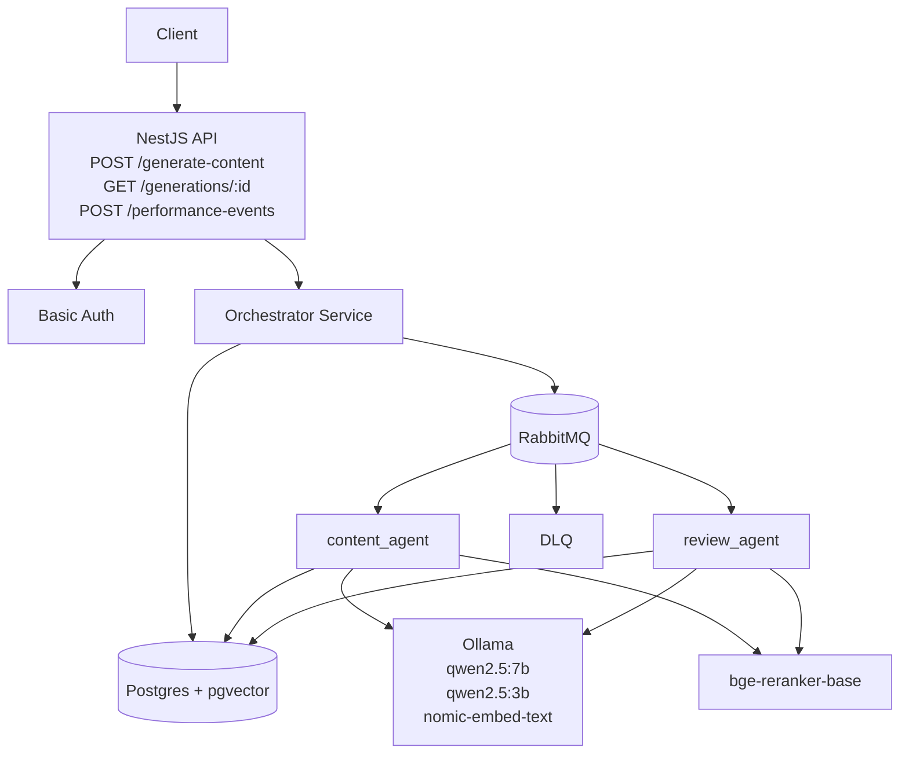

# AI Content Engine (NestJS Orchestrator + Python Agents) - Build Guide

## Goal

A portfolio-grade AI Engineering project with:

- centralized orchestration in NestJS
- RabbitMQ workers implemented in Python
- RAG for every generation step
- Postgres + `pgvector` as the vector store
- strict structured outputs with Pydantic v2 as the source of truth
- self-healing outputs via repair loop
- full tracing, latency and cost tracking
- prompt versioning in the repository
- persistent user memory for `persona`, `knowledge` and `performance`
- fully local execution with Docker + Ollama

This document is the updated Markdown build guide for the project. It reflects the locked MVP decisions from the questionnaire and the action plan.

## 0. High-level decisions (locked)

- Orchestration: centralized in NestJS
- API mode: asynchronous for clients
- Internal transport: RabbitMQ RPC between orchestrator and agents
- Vector store: Postgres + `pgvector`
- RAG: mandatory for `content_agent` and `review_agent`
- Output contract: one global schema, versioned
- Source of truth for schema: Pydantic v2 in Python
- API validation: NestJS validates the final response using exported JSON Schema
- Pipeline config: stored in the database and referenced by request preset
- Initial MVP pipeline: `content -> review`
- Multi-tenancy: enabled in the MVP with basic authentication and per-user data isolation
- Repair policy: run on invalid JSON or empty required fields
- Repair attempts: up to 3
- Retry policy: up to 3 attempts per step
- DLQ: enabled in the MVP for terminal failures
- Prompt persistence: prompt text and retrieval previews can be stored in the database
- Main LLM: Ollama `qwen2.5:7b`
- Fallback and repair LLM: Ollama `qwen2.5:3b`
- Embeddings: Ollama `nomic-embed-text`
- Reranker: local cross-encoder `BAAI/bge-reranker-base`
- Observability: custom persistence with future OpenTelemetry compatibility

## 1. MVP scope

The MVP must prove the architecture end-to-end without expanding into the full multi-agent system too early.

### Included in the MVP

1. NestJS API + centralized orchestrator
2. Basic authentication and per-user data isolation
3. Asynchronous generation flow:
   - `POST /generate-content`
   - `GET /generations/:id`
4. Performance ingestion endpoint:
   - `POST /performance-events`
5. RabbitMQ RPC wiring with retry and DLQ
6. Postgres + `pgvector` with a minimal RAG store
7. Two Python agents:
   - `content_agent`
   - `review_agent`
8. Prompt versioning with `v1`, `v2`, and repair templates
9. Pydantic schema validation with a global schema
10. Repair loop with up to 3 attempts
11. LLM tracing + cost tracking persisted in Postgres
12. Performance memory persistence, with optional retrieval usage in v1

### Not included in the MVP

- `trend_agent`
- `strategy_agent`
- `media_agent`
- free-form pipeline definition directly in the request payload
- hybrid lexical + vector search
- advanced distributed rate limiting
- provider failover across different LLM vendors
- strong performance-memory weighting by default in retrieval

### MVP endpoint behavior

`POST /generate-content`

- validates request
- loads the selected pipeline preset
- creates a `generation_id`
- queues work
- returns immediately with status metadata

`GET /generations/:id`

- returns generation status
- returns final result when completed
- returns structured errors when failed

`POST /performance-events`

- stores user performance events
- prepares future retrieval usage for `performance_memory`

### MVP success criteria

- `POST /generate-content` returns an ACK in under 2 seconds in normal cases
- one request triggers sequential RabbitMQ jobs through `content -> review`
- each agent performs retrieval + reranking + generation
- outputs conform to the global schema, or the repair loop is triggered
- traces show prompt, docs used, tokens, cost and latency per step
- failures become auditable through `generation_steps`, `llm_traces` and DLQ routing

## 2. Post-MVP increments

### Increment A - planning intelligence

- add `trend_agent`
- add `strategy_agent`
- expand curated RAG with strategy-specific docs

Pipeline becomes:

- `trend -> strategy -> content -> review`

### Increment B - media

- add `media_agent`
- output `image_prompt`, `carousel`, and `video_prompt`
- optionally integrate image generation later

Pipeline becomes:

- `trend -> strategy -> content -> review -> media`

### Increment C - performance learning

- turn `performance_memory` retrieval on by default
- enrich ingestion and retrieval weighting
- use performance docs inside `strategy_agent` and `content_agent`

### Increment D - hardening

- circuit breaker
- provider failover
- rate limiting
- replay tools for DLQ
- hybrid search

## 3. Updated architecture diagram



Notes:

- the client-facing API is asynchronous
- the orchestrator is the only component that controls state transitions
- agents do not talk to each other directly
- the same Postgres instance stores generation state, RAG docs, traces and costs
- DLQ is part of the MVP, not a future improvement

## 4. API contract and generation lifecycle

### 4.1 `POST /generate-content`

Recommended request shape:

```json
{
  "topic": "RAG with reranking in production",
  "platform": "linkedin",
  "format": "thread",
  "pipeline_preset_id": "uuid",
  "persona_id": "uuid"
}
```

Recommended response shape:

```json
{
  "generation_id": "uuid",
  "status": "queued",
  "status_url": "/generations/uuid"
}
```

### 4.2 `GET /generations/:id`

Recommended response shape:

```json
{
  "generation_id": "uuid",
  "status": "completed",
  "result": {
    "topic": "RAG with reranking in production",
    "strategy": {
      "goal": null,
      "angle": null,
      "audience": null
    },
    "post": {
      "hook": "Hook text",
      "body": "Body text",
      "cta": "CTA text"
    },
    "media": {
      "image_prompt": null,
      "carousel": [],
      "video_prompt": null
    },
    "metadata": {
      "platform": "linkedin",
      "format": "thread",
      "pipeline": ["content", "review"],
      "generation_id": "uuid",
      "schema_version": "v1",
      "persona_id": "uuid",
      "performance_context_used": false
    }
  },
  "errors": []
}
```

### 4.3 `POST /performance-events`

Recommended request shape:

```json
{
  "generation_id": "uuid",
  "platform": "linkedin",
  "post_id": "linkedin-post-id",
  "metrics": {
    "likes": 120,
    "comments": 15,
    "shares": 8,
    "impressions": 3400,
    "engagement_rate": 0.042
  }
}
```

## 5. Global schema

The project uses one global schema. Each step fills or updates part of the same document.

### Required MVP fields

- `topic`
- `post.hook`
- `post.body`
- `post.cta`
- `metadata.platform`
- `metadata.format`
- `metadata.pipeline`
- `metadata.generation_id`
- `metadata.schema_version`

### Allowed to be empty in the MVP

- `strategy.goal`
- `strategy.angle`
- `strategy.audience`
- `media.image_prompt`
- `media.carousel`
- `media.video_prompt`
- `metadata.persona_id`
- `metadata.performance_context_used`

### Conceptual schema example

```json
{
  "topic": "...",
  "strategy": {
    "goal": null,
    "angle": null,
    "audience": null
  },
  "post": {
    "hook": "...",
    "body": "...",
    "cta": "..."
  },
  "media": {
    "image_prompt": null,
    "carousel": [],
    "video_prompt": null
  },
  "metadata": {
    "platform": "linkedin|x|...",
    "format": "thread|short|...",
    "pipeline": ["content", "review"],
    "generation_id": "uuid",
    "schema_version": "v1",
    "persona_id": "uuid|null",
    "performance_context_used": false
  }
}
```

Implementation rule:

- Pydantic v2 is the source of truth
- exported JSON Schema is used by NestJS for validation
- `review_agent` returns the entire document, not a patch

## 6. Database schema (Postgres + pgvector)

Prerequisites:

- Postgres 15+
- `vector` extension
- `pgcrypto` extension

Important:

- keep the embedding dimension consistent with the configured embedding model
- use a config constant such as `EMBED_DIM` in migrations and application code

### Recommended DDL

```sql
CREATE EXTENSION IF NOT EXISTS vector;
CREATE EXTENSION IF NOT EXISTS pgcrypto;

CREATE TABLE IF NOT EXISTS users (
  id UUID PRIMARY KEY DEFAULT gen_random_uuid(),
  email TEXT NOT NULL UNIQUE,
  password_hash TEXT NOT NULL,
  created_at TIMESTAMPTZ NOT NULL DEFAULT now()
);

CREATE TABLE IF NOT EXISTS pipeline_presets (
  id UUID PRIMARY KEY DEFAULT gen_random_uuid(),
  user_id UUID NULL REFERENCES users(id),
  name TEXT NOT NULL,
  steps JSONB NOT NULL,
  is_active BOOLEAN NOT NULL DEFAULT TRUE,
  created_at TIMESTAMPTZ NOT NULL DEFAULT now()
);

CREATE TABLE IF NOT EXISTS generations (
  id UUID PRIMARY KEY DEFAULT gen_random_uuid(),
  user_id UUID NOT NULL REFERENCES users(id),
  pipeline_preset_id UUID NULL REFERENCES pipeline_presets(id),
  topic TEXT NOT NULL,
  platform TEXT NOT NULL,
  format TEXT NOT NULL,
  pipeline JSONB NOT NULL,
  schema_version TEXT NOT NULL DEFAULT 'v1',
  status TEXT NOT NULL DEFAULT 'queued', -- queued|running|completed|failed
  result_json JSONB NULL,
  error_json JSONB NULL,
  created_at TIMESTAMPTZ NOT NULL DEFAULT now(),
  started_at TIMESTAMPTZ NULL,
  completed_at TIMESTAMPTZ NULL
);

CREATE TABLE IF NOT EXISTS generation_steps (
  id UUID PRIMARY KEY DEFAULT gen_random_uuid(),
  generation_id UUID NOT NULL REFERENCES generations(id) ON DELETE CASCADE,
  step_name TEXT NOT NULL, -- content|review
  status TEXT NOT NULL DEFAULT 'queued', -- queued|running|completed|failed|dlq
  attempt_count INT NOT NULL DEFAULT 0,
  input_json JSONB NOT NULL,
  output_json JSONB NULL,
  error_json JSONB NULL,
  reply_metadata JSONB NOT NULL DEFAULT '{}'::jsonb,
  started_at TIMESTAMPTZ NULL,
  finished_at TIMESTAMPTZ NULL,
  UNIQUE(generation_id, step_name)
);

CREATE TABLE IF NOT EXISTS rag_documents (
  id UUID PRIMARY KEY DEFAULT gen_random_uuid(),
  user_id UUID NULL REFERENCES users(id),
  doc_type TEXT NOT NULL, -- persona|knowledge|performance
  platform TEXT NULL,
  structure TEXT NULL,
  tags TEXT[] NULL,
  source TEXT NULL,
  content TEXT NOT NULL,
  metadata JSONB NOT NULL DEFAULT '{}'::jsonb,
  embedding VECTOR(<EMBED_DIM>) NOT NULL,
  created_at TIMESTAMPTZ NOT NULL DEFAULT now()
);

CREATE INDEX IF NOT EXISTS rag_documents_embedding_idx
ON rag_documents
USING ivfflat (embedding vector_cosine_ops)
WITH (lists = 100);

CREATE INDEX IF NOT EXISTS rag_documents_type_idx ON rag_documents(doc_type);
CREATE INDEX IF NOT EXISTS rag_documents_user_idx ON rag_documents(user_id);
CREATE INDEX IF NOT EXISTS rag_documents_platform_idx ON rag_documents(platform);
CREATE INDEX IF NOT EXISTS rag_documents_tags_gin_idx ON rag_documents USING GIN(tags);

CREATE TABLE IF NOT EXISTS llm_traces (
  id UUID PRIMARY KEY DEFAULT gen_random_uuid(),
  generation_id UUID NOT NULL REFERENCES generations(id) ON DELETE CASCADE,
  step_name TEXT NOT NULL,
  agent_name TEXT NOT NULL,
  provider TEXT NOT NULL,
  model TEXT NOT NULL,
  prompt_version TEXT NOT NULL,
  prompt_text TEXT NOT NULL,
  retrieved_doc_ids UUID[] NOT NULL DEFAULT '{}',
  retrieved_docs_preview JSONB NOT NULL DEFAULT '[]'::jsonb,
  tokens_in INT NOT NULL DEFAULT 0,
  tokens_out INT NOT NULL DEFAULT 0,
  latency_ms INT NOT NULL DEFAULT 0,
  cost_usd NUMERIC(12,6) NOT NULL DEFAULT 0,
  output_json JSONB NULL,
  error_json JSONB NULL,
  otel_trace_id TEXT NULL,
  otel_span_id TEXT NULL,
  created_at TIMESTAMPTZ NOT NULL DEFAULT now()
);

CREATE INDEX IF NOT EXISTS llm_traces_generation_idx ON llm_traces(generation_id);
CREATE INDEX IF NOT EXISTS llm_traces_step_idx ON llm_traces(step_name);

CREATE TABLE IF NOT EXISTS generation_costs (
  generation_id UUID PRIMARY KEY REFERENCES generations(id) ON DELETE CASCADE,
  total_tokens_in INT NOT NULL DEFAULT 0,
  total_tokens_out INT NOT NULL DEFAULT 0,
  total_cost_usd NUMERIC(12,6) NOT NULL DEFAULT 0,
  updated_at TIMESTAMPTZ NOT NULL DEFAULT now()
);

CREATE TABLE IF NOT EXISTS performance_events (
  id UUID PRIMARY KEY DEFAULT gen_random_uuid(),
  user_id UUID NOT NULL REFERENCES users(id),
  generation_id UUID NULL REFERENCES generations(id) ON DELETE SET NULL,
  platform TEXT NOT NULL,
  post_id TEXT NULL,
  metrics JSONB NOT NULL,
  created_at TIMESTAMPTZ NOT NULL DEFAULT now()
);
```

## 7. RAG design and reranking

Every agent uses the same retrieval stack.

### Step 1 - Build the query

Use an agent-specific query template:

- `content_agent`: `persona + topic + format + platform`
- `review_agent`: `quality criteria + platform rules + style constraints`

### Step 2 - Vector search

- embed the query with `nomic-embed-text`
- retrieve `top_k = 20`
- filter by `doc_type`, `platform`, `user_id` and tags where relevant

Example retrieval conditions:

```sql
WHERE doc_type IN ('persona', 'knowledge', 'performance')
  AND (platform IS NULL OR platform = :platform)
  AND (user_id IS NULL OR user_id = :user_id)
```

### Step 3 - Rerank

- run `BAAI/bge-reranker-base` on the top 20 results
- keep the top 5
- store the selected document IDs in `llm_traces.retrieved_doc_ids`

### Step 4 - Build structured prompt context

Use structured context blocks instead of one large blob:

- `persona_context`
- `knowledge_context`
- `performance_context`
- `examples_context`

Note:

- `performance_context` is persisted in the MVP, but retrieval use can remain optional in v1

## 8. Prompt versioning

Recommended directory layout:

```text
prompts/
  content_agent/
    v1.jinja
    v2.jinja
  review_agent/
    v1.jinja
    v2.jinja
  repair/
    repair_v1.jinja
```

Rules:

- prompts must live in files, not inline strings
- every LLM call includes `prompt_version`
- any behavioral change increments the prompt version

Recommended sections per prompt:

- `system`
- `instructions`
- `context`
- `output_schema`

## 9. Self-healing outputs (repair loop)

Validation rules:

- parse with Pydantic v2
- trigger repair if JSON is invalid
- trigger repair if required fields are empty

Repair workflow:

1. validate model output
2. if invalid, call `repair_v1.jinja`
3. use `qwen2.5:3b` for repair
4. pass:
   - raw output
   - validation errors
   - expected schema
5. validate again
6. retry up to 3 times
7. if still invalid:
   - persist raw invalid output
   - mark step failed
   - route to DLQ
   - fail the generation

This is one of the main portfolio features of the system:

- robust structured generation with validation + repair + auditable failure mode

## 10. Tracing and cost tracking

For every agent call, persist:

- `generation_id`
- `step_name`
- `agent_name`
- `provider`
- `model`
- `prompt_version`
- `prompt_text`
- `retrieved_doc_ids`
- `retrieved_docs_preview`
- `tokens_in`
- `tokens_out`
- `latency_ms`
- `cost_usd`
- `output_json`
- `error_json`
- `created_at`

### Cost calculation

Even with Ollama, keep a configurable price table so the architecture stays portable:

```text
PRICES[provider][model] = {
  input_per_1k,
  output_per_1k
}
```

Then:

```text
cost_usd = (tokens_in / 1000) * input_price
         + (tokens_out / 1000) * output_price
```

Persist:

- one row in `llm_traces`
- one aggregate update in `generation_costs`

Also prepare identifiers for future OpenTelemetry export.

## 11. Orchestrator structure in NestJS

Recommended layout:

```text
orchestrator/
  src/
    app.module.ts
    main.ts
    auth/
      auth.module.ts
      auth.service.ts
      auth.controller.ts
    config/
      rabbitmq.config.ts
      llm-prices.config.ts
      env.validation.ts
    generate/
      generate.controller.ts
      generate.service.ts
      dto/
        generate-request.dto.ts
        generate-ack.dto.ts
    generations/
      generations.controller.ts
      generations.service.ts
      dto/
        generation-status.dto.ts
    performance/
      performance.controller.ts
      performance.service.ts
    pipeline/
      pipeline.registry.ts
      pipeline.executor.ts
    rabbit/
      rabbit.module.ts
      rabbit.rpc-client.ts
      rabbit.constants.ts
      rabbit.dlq.service.ts
    persistence/
      prisma/ or typeorm/
      repositories/
      migrations/
    tracing/
      tracing.service.ts
      types.ts
```

Core logic:

- `GenerateController` validates request and creates a generation
- `GenerateService` stores a row in `generations`
- `PipelineExecutor` loads the preset and executes steps sequentially
- for each step:
  - insert or update `generation_steps`
  - send RPC request to the queue
  - wait for the reply with timeout
  - retry up to 3 times if needed
  - persist output or failure
- if retries are exhausted:
  - route to DLQ
  - mark step failed
  - mark generation failed
- when the last step succeeds:
  - validate the final schema in NestJS
  - write `result_json`
  - mark generation completed

### RabbitMQ RPC approach

- `correlationId = generation_id + ":" + step_name`
- use `replyTo` for worker replies
- worker must reply with the same `correlationId`

### Idempotency

- use `UNIQUE(generation_id, step_name)`
- do not re-run a completed step unless explicitly forced

## 12. Python agent structure

Recommended layout:

```text
agents/
  shared/
    llm/
      client.py
      pricing.py
    rag/
      embedder.py
      retriever.py
      reranker.py
    prompts/
      loader.py
    tracing/
      trace_writer.py
    schemas/
      content_schema.py
    repair/
      repair.py
    rabbit/
      worker.py
  content_agent/
    handler.py
  review_agent/
    handler.py
```

Worker contract:

- Input:

```json
{
  "generation_id": "uuid",
  "step_name": "content",
  "input_json": {},
  "user_id": "uuid",
  "prompt_version": "v1",
  "config": {
    "provider": "ollama",
    "model": "qwen2.5:7b"
  }
}
```

- Output:

```json
{
  "output_json": {},
  "reply_metadata": {
    "tokens_in": 0,
    "tokens_out": 0,
    "latency_ms": 0,
    "repair_attempts": 0
  }
}
```

Each handler must:

1. retrieve and rerank relevant docs
2. render the selected prompt version
3. call the main LLM
4. validate with Pydantic
5. trigger repair if needed
6. write `llm_traces`
7. update cost aggregates
8. reply to the orchestrator

## 13. Concrete implementation steps

### A. Infra bootstrap

- [ ] `docker-compose` with Postgres + `pgvector`, RabbitMQ, Ollama, orchestrator and agents
- [ ] local model bootstrap for `qwen2.5:7b`, `qwen2.5:3b`, `nomic-embed-text`
- [ ] install or document `BAAI/bge-reranker-base`
- [ ] environment variables for auth, queues, DB and models

### B. Persistence and auth

- [ ] create migrations for `users`
- [ ] create migrations for `pipeline_presets`
- [ ] create migrations for `generations`
- [ ] create migrations for `generation_steps`
- [ ] create migrations for `rag_documents`
- [ ] create migrations for `llm_traces`
- [ ] create migrations for `generation_costs`
- [ ] create migrations for `performance_events`
- [ ] seed starter `knowledge` docs
- [ ] seed a sample `persona` doc
- [ ] seed `content_review_v1`
- [ ] implement basic auth

### C. Async API and orchestrator

- [ ] `POST /generate-content` with validation
- [ ] `GET /generations/:id`
- [ ] `POST /performance-events`
- [ ] create `generation_id`
- [ ] load pipeline preset from DB
- [ ] implement sequential `PipelineExecutor`
- [ ] implement RabbitMQ RPC client
- [ ] implement retry + DLQ behavior
- [ ] store step snapshots in `generation_steps`

### D. Agents

- [ ] shared Ollama client
- [ ] embeddings + `pgvector` retrieval
- [ ] local reranker
- [ ] prompt loader and versioning
- [ ] Pydantic models + JSON Schema export
- [ ] repair loop
- [ ] trace writer + cost aggregation
- [ ] implement `content_agent`
- [ ] implement `review_agent`

### E. Performance memory

- [ ] ingest `performance_events`
- [ ] persist performance data per user
- [ ] expose `metadata.performance_context_used`
- [ ] keep retrieval usage optional in v1

### F. Validation and demo

- [ ] run end-to-end flow
- [ ] verify `generation_steps`
- [ ] verify `llm_traces`
- [ ] verify `generation_costs`
- [ ] verify final JSON schema compliance
- [ ] prepare demo scenario

## 14. Recommended demo scenario

Demo input:

- `persona_id`: a user persona doc
- `platform`: `linkedin`
- `format`: `thread`
- `topic`: `RAG with reranking in production`
- `pipeline_preset_id`: `content_review_v1`

Demo flow:

1. call `POST /generate-content`
2. receive `generation_id`
3. poll `GET /generations/:id`
4. inspect generated thread
5. inspect traces and step snapshots
6. optionally post a sample `performance_event`

What makes this strong for portfolio review:

- asynchronous API with real orchestration semantics
- strict structured outputs with repair loop
- real RAG with vector search + reranking
- per-step tracing and cost accounting
- versioned prompts in the repo
- clear separation between orchestrator and workers
- local-first stack that can still evolve to cloud providers later

## 15. Minimal definition of done for the MVP

The MVP is done when:

- `POST /generate-content` returns `generation_id`
- `GET /generations/:id` returns status and final result
- basic auth exists and data is isolated per user
- `content_agent` and `review_agent` run through RabbitMQ workers
- each step is idempotent for `generation_id + step_name`
- retry works up to 3 times per step
- DLQ receives terminal failures
- RAG uses `pgvector` retrieval + local reranking
- the final output validates against the versioned global schema
- repair runs on invalid JSON and empty required fields
- `llm_traces` contains prompt, doc IDs, tokens, cost and latency
- `generation_costs` aggregates totals
- `performance_events` are persisted
- prompts are versioned in the repo

Build the MVP first with `content -> review`, then expand into the full pipeline.
